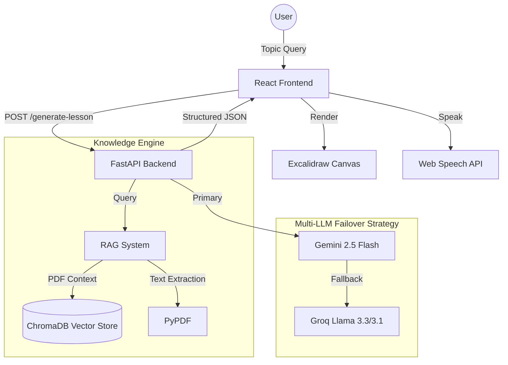

# Private Tutor: AI-Powered "Blackboard" Teacher

Private Tutor is a sophisticated educational platform that transforms complex topics into interactive, visual lessons. Unlike traditional AI tutors that just provide text, this system acts like a master teacher on a digital blackboard, generating detailed diagrams and spoken voiceovers.

## 🚀 System Architecture

---

## 🛠 Technical Stack

### Backend (Python/FastAPI)
- **FastAPI**: High-performance web framework for the API layer.
- **Multi-LLM Router**: A custom failover system that prioritizes **Gemini 2.5 Flash** for its structured output capabilities, with **Groq (Llama 3.3 70B)** as a high-speed fallback.
- **RAG (Retrieval-Augmented Generation)**:
  - **PyPDF**: Extracts text from uploaded study materials.
  - **SentenceTransformers**: Generates semantic embeddings for document chunks.
  - **ChromaDB**: An in-memory vector database for fast similarity searches.
- **Pydantic**: Strict schema validation to ensure the LLM output matches the frontend's visual requirements.

### Frontend (React/TypeScript)
- **Vite**: Modern build tool for a fast development experience.
- **Excalidraw**: A powerful whiteboarding library used to render the "blackboard" slides dynamically.
- **Web Speech API**: Provides real-time text-to-speech for the tutor's voiceover.
- **Tailwind CSS & Vanilla CSS**: For a premium, responsive, and collapsible UI.

---

## 🧠 Logical Core: The "Blackboard" Philosophy

The project uses advanced prompt engineering to enforce a specific teaching style:

1.  **Information Density**: Every shape (rectangle, ellipse) generated by the AI MUST contain a text label with specific data (formulas, units, or key terms). Placeholder labels like "Concept" are strictly forbidden.
2.  **Spatial Awareness**: For topics like the "Water Cycle" or "Cell Biology," the AI is instructed to ignore generic flowcharts and instead recreate the actual physical layout of the system.
3.  **Canvas Zoning**: The 1000x800 canvas is divided into logic zones:
    - **Top**: Title and definitions.
    - **Left**: Inputs, causes, or primary concepts.
    - **Right**: Outputs, effects, or results.
    - **Bottom**: Summary and key takeaways.
4.  **Dynamic Slide Scaling**: The system analyzes the complexity of the topic to generate between 2 and 8 slides, ensuring simple topics are concise and complex ones are thorough.

---

## ✨ Key Features

- **Multi-Model Failover**: If the Gemini API hits a rate limit or goes down, the system transparently switches to Groq to ensure no interruption for the student.
- **PDF Study Support**: Students can upload their own PDFs. The RAG system will extract context and force the AI to teach specifically from those materials.
- **Interactive Navigation**: A collapsible slide thumbnail strip allows students to jump between different parts of the lesson.
- **Distraction-Free Mode**: The voiceover panel and navigation strips can be collapsed to give full screen real-estate to the diagrams.
- **Model Transparency**: A badge in the UI shows exactly which AI model (Gemini or Groq) is currently serving the lesson.

---

## 🛠 Development Highlights

- **Windows Compatibility**: Specialized fixes for the "charmap" encoding issues and SQLite file-locking bugs common in Windows development environments.
- **Ghost Process Cleanup**: Automated strategy for managing background uvicorn processes to prevent port conflicts.
- **Premium Design**: A dark-themed, glassmorphic UI that feels modern and professional.

---
*Created by Antigravity AI Coding Assistant*
